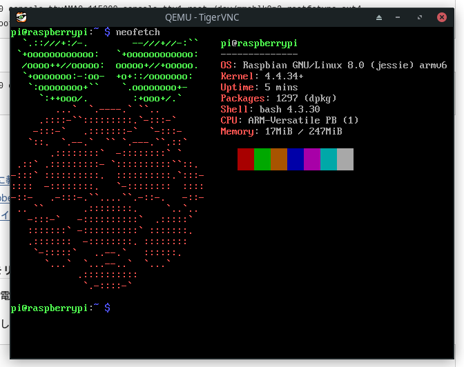

# Raspberry Piで使ってたSDカードはQEMUで動かせるのか

## はじめに

[先日の記事](/blog/bmsuploader-bot-on-aws/)で軽く触れたけど家に置いてあるRaspberry Pi (Model B Rev.2)のRaspbianがEOLを迎えたので更新することにした。それでもちろんバックアップとかを取ったんだけどその際SDカードを常用してるマシンで読み書きできれば色々捗るのでは?と思いやり方やら色々調べた記録。

結論としては起動はしたけどデータのやり取りは上手く行かなかった。あと普通にシステムが破損してもおかしくないと思うので真似する人が万が一いても自己責任で。

(2020/11/12 追記)ネットワーク設定を変えたら上手くいったので追記。

## 準備

ホスト環境: Manjaro Linux (x86_64)

SDカードに焼いてある環境: Raspbian 8 (armv6)

まずそもそもARMをx86_64で動かしたいのでなんにしても[QEMU](https://www.qemu.org/)は必須である。

```sh
pacman -S qemu qemu-extra-arch
```

更にQEMU用にLinux kernelを用意するらしいんだけどこれはraspi向けにビルドして公開してくれている人がいるらしいのでそれを使う。

[GitHub - dhruvvyas90/qemu-rpi-kernel: Qemu kernel for emulating Rpi on QEMU](https://github.com/dhruvvyas90/qemu-rpi-kernel)

Raspbian 8はDebian 8 jessieに対応してるはずなので kernel-qemu-4.4.34-jessieを使えば良い…はず。

## 起動

とは言っても先のリポジトリの[wiki](https://github.com/dhruvvyas90/qemu-rpi-kernel/wiki)に従ってやるだけである。

最終的なコマンドは以下のようになった。

```sh
sudo qemu-system-arm \
    -kernel ./kernel-qemu-4.4.34-jessie \
    -machine versatilepb \
    -cpu arm1176 \
    -m 256 \
    -no-reboot \
    -append "root=/dev/sda2 panic=1 rootfstype=ext4 rw" \
    -drive "file=/dev/mmcblk0,index=0,media=disk,format=raw"
```

wikiと違う点はimgファイルを指定している箇所をホストでSDカードを示す箇所に変えるというところくらいか。結果無事に起動してくれた。ちょっと嬉しい。



でも一つ問題があってwikiに書いてある-netオプションを加えてもなぜだかネットワークが有効にならない。QEMU慣れすらしていないのでこれについては素直に諦めてしまった。一切いじってないイメージなら使えるのかな?
まあ最低限のコマンドは動くみたいだから設定値をメモするくらいならなんとか行けるか…?

## ネットワーク上手くいった (2020/11/12 追記)

これまでネットワークの設定は上記コマンドに`-net nic`を加えてやっててそれで上手く行かなかったんだけど、`macaddr`を更に加えることでこの環境では上手くいくことが判明した。つまり、

```sh
sudo qemu-system-arm \
    -kernel ./kernel-qemu-4.4.34-jessie \
    -machine versatilepb \
    -cpu arm1176 \
    -m 256 \
    -no-reboot \
    -append "root=/dev/sda2 panic=1 rootfstype=ext4 rw" \
    -drive "file=/dev/mmcblk0,index=0,media=disk,format=raw" \
    -net nic,macaddr=52:54:XX:XX:XX:XX # XX:.. は適当な16進数
```

というようにするとログインしてからインターネット上の適当な箇所に対しpingが通るようになった。`52:54:`の出典は[ArchWiki](https://wiki.archlinux.jp/index.php/QEMU#.E3.83.AA.E3.83.B3.E3.82.AF.E5.B1.A4.E3.82.A2.E3.83.89.E3.83.AC.E3.82.B9)から。この`-net`に加え`-net user,hostfwd=tcp::15555-:22`みたいなのを指定するとホストからゲストにsshで繋げられるようになった。

```sh
ssh pi@localhost -p 15555
```

ただしちょっと調べたら[macaddrがあるとダメなパターン](https://twitter.com/satoh_fumiyasu/status/302002146092650496)とかもあるらしく詳しくない身としては両方やってみようとしか言えない。どっちか上手くいくことを祈ろう。

## 参考文献

- [Raspberry virtual machine from sdcard (linux/mac)](https://medium.com/@cztomsik/raspberry-virtual-machine-from-sdcard-linux-mac-6f02d3087997)

    最初に参考にしたけどこれではできなかった

- [GitHub - dhruvvyas90/qemu-rpi-kernel: Qemu kernel for emulating Rpi on QEMU](https://github.com/dhruvvyas90/qemu-rpi-kernel)

    既に貼ったやつ

- [QEMU – Emulating Raspberry Pi the easy way (Linux or Windows!)](https://webcache.googleusercontent.com/search?q=cache:https://pub.phyks.me/respawn/mypersonaldata/public/2014-05-20-11-08-01/)

    ↑のwikiの更に元になったページのアーカイブのアーカイブ(?)

- [Emulate Raspberry Pi with QEMU | graznik.de](http://graznik.de/posts/emulate-raspberry-pi-with-qemu/)

    macaddr指定のきっかけをくれた救世主

- [QEMU - ArchWiki](https://wiki.archlinux.jp/index.php/QEMU)

    QEMUに限らずArchWikiは情報量が多くて素晴らしい
